**目录**：

>笔记持续更新，原地址 : https://github.com/Niefee/Wangyi-Note ;


<ul>
<li><a href="#布局">布局</a><ul>
<li><a href="#display">display</a><ul>
<li><a href="#block">block</a></li>
<li><a href="#inline">inline</a></li>
<li><a href="#inline-block">inline-block</a></li>
<li><a href="#none">none</a></li>
<li><a href="#居中导航">居中导航</a></li>
</ul>
</li>
<li><a href="#position">position</a><ul>
<li><a href="#toptightbottomleft">top/tight/bottom/left</a></li>
<li><a href="#z-index">z-index</a><ul>
<li><a href="#z-index栈">z-index栈</a></li>
</ul>
</li>
<li><a href="#position属性">position属性</a><ul>
<li><a href="#relative">relative</a></li>
<li><a href="#absolute">absolute</a></li>
<li><a href="#fixed">fixed</a></li>
<li><a href="#遮罩">遮罩</a></li>
<li><a href="#自适应三栏布局">自适应三栏布局</a></li>
</ul>
</li>
</ul>
</li>
<li><a href="#float">float</a></li>
<li><a href="#clear">clear</a><ul>
<li><a href="#两列布局">两列布局</a></li>
</ul>
</li>
<li><a href="#flex">flex</a><ul>
<li><a href="#flex-item">flex item</a></li>
<li><a href="#flex-direction">flex-direction</a></li>
<li><a href="#flex-wrap">flex-wrap</a></li>
<li><a href="#flex-flow">flex-flow</a></li>
<li><a href="#order">order</a></li>
<li><a href="#flex-basis">flex-basis</a></li>
<li><a href="#flex-grow">flex-grow</a></li>
<li><a href="#flex-shrink">flex-shrink</a></li>
<li><a href="#flex-1">flex</a></li>
<li><a href="#justify-content">justify-content</a></li>
<li><a href="#align-items">align-items</a></li>
<li><a href="#align-self">align-self</a></li>
<li><a href="#align-content">align-content</a></li>
<li><a href="#三行两列自适应布局">三行两列自适应布局</a></li>
</ul>
</li>
</ul>
</li>
</ul>
##布局
元素以正确的大小摆放在正确的位置上。
###display

####block

####inline
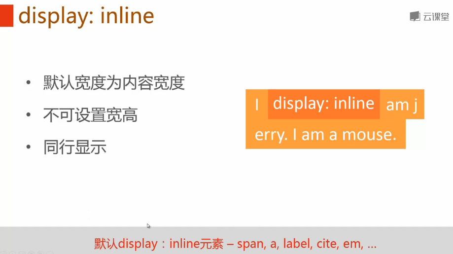
>对比：
> 

####inline-block

>主要是表单元素。

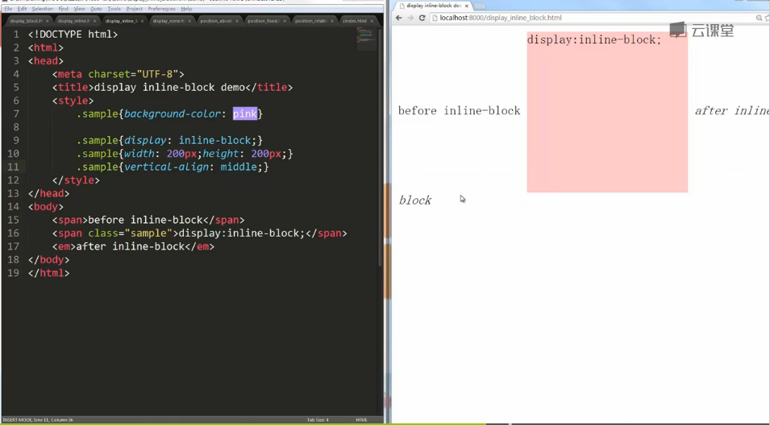
####none
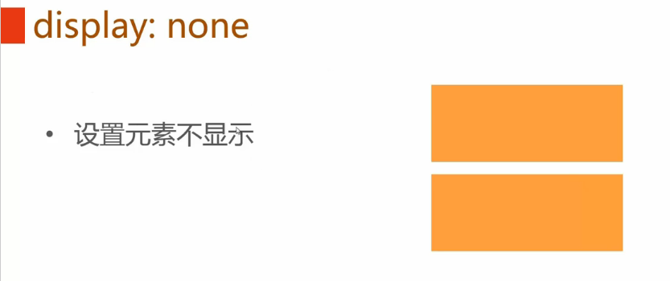
>display：none与visibility：hidden的区别
>
>后者保留空间，前者会忽略空间。

####居中导航


###position

####top/tight/bottom/left
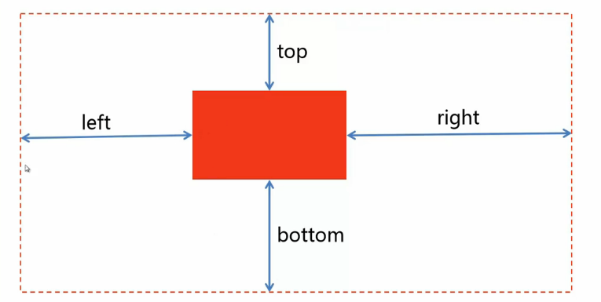
####z-index
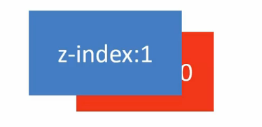
>默认是 0，数字小在下面。


#####z-index栈


####position属性
#####relative
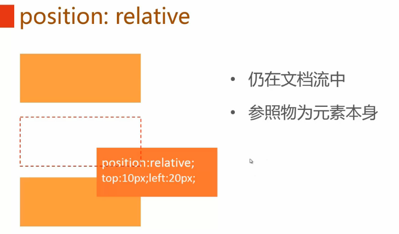
#####absolute


> - **实例**
轮播头图：


#####fixed
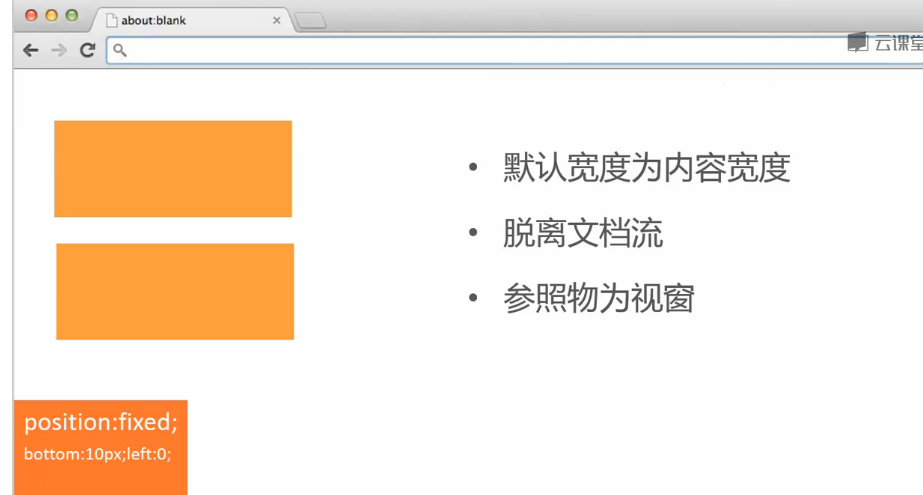

> - 实例
> 固定顶栏：
> 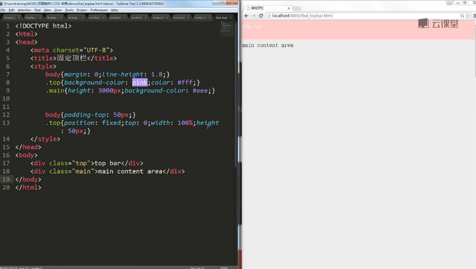

#####遮罩


#####自适应三栏布局
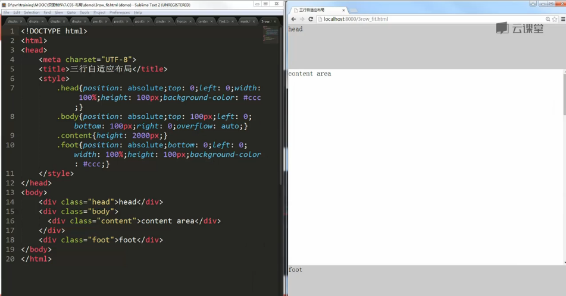
###float

>none是默认值


> 在原来高度不变的位置，向左或者向移动排列。


**文档流**


###clear


 - 增加一个清除浮动的元素cb


代码如下：
```
方案一：

.cb{clear: both; 
	   height: 0;
	   overflow: hidden;
	   visibility: hidden;
}

方案二：
.clearfix:after {
	content: '.';
	display: block;
	clear: both;
	height: 0;
	overflow: hidden;
	visibility: hidden;
}
```


---

####两列布局

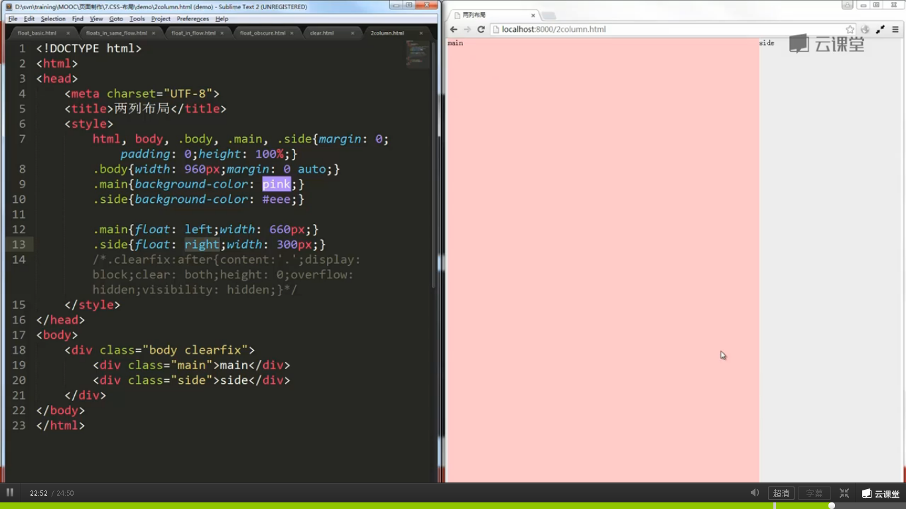

###flex
> **适用于父类容器元素上**


>只作用域直接子元素。


####flex item

####flex-direction
**弹性容器的方向**
>定义：设置或检索伸缩盒对象的子元素在父容器中的位置.适用于父类容器的元素上
> - row：横向从左到右排列（左对齐），默认的排列方式。

> - row-reverse：反转横向排列（右对齐，从后往前排，最后一项排在最前面。
> - column：纵向排列。
> - row-reverse：反转纵向排列，从后往前排，最后一项排在最上面。

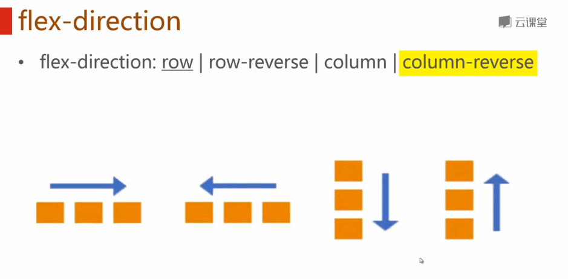

####flex-wrap

**弹性容器的换行**
>设置或检索伸缩盒对象的子元素超出父容器时是否换行。(适用于父类容器上。
> nowrap：当子元素溢出父容器时不换行。
wrap：当子元素溢出父容器时自动换行。
wrap-reverse：反转 wrap 排列。


####flex-flow
**子元素排列方式**
>**复合属性**。设置或检索伸缩盒对象的子元素排列方式。适用于父类容器上。
>[ flex-direction ]：定义弹性盒子元素的排列方向。
>[ flex-wrap ]：定义弹性盒子元素溢出父容器时是否换行。


####order
**子元素排序**
>用整数值来定义排列顺序，数值小的排在前面。可以为负值。适用于弹性盒模型容器子元素。


####flex-basis
>设置或检索弹性盒伸缩基准值。适用于弹性盒模型容器**子元素**。
>auto：无特定宽度值，取决于其它属性值
< length>：用长度值来定义宽度。不允许负值
< percentage>：用百分比来定义宽度。不允许负值


####flex-grow
**扩展比率**
>根据弹性盒子元素所设置的扩展因子作为比率来分配剩余空间。
> 
>语法：flex-grow: < number> (default 0)
>
< number>：用数值来定义扩展比率。不允许负值
flex-grow的默认值为0，如果没有显示定义该属性，是不会拥有分配剩余空间权利的。本例中b,c两项都显式的定义了flex-grow，可以看到总共将剩余空间分成了4份，其中b占1份，c占3分，即1:3


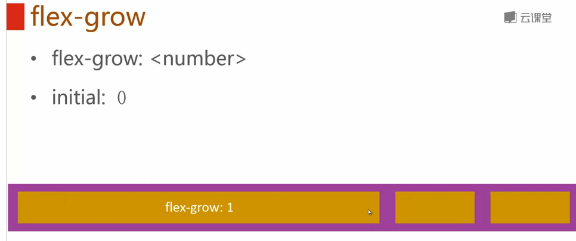


####flex-shrink
**收缩比率**
>设置或检索弹性盒的收缩比率（根据弹性盒子元素所设置的收缩因子作为比率来收缩空间。）
>
>flex-shrink: <number> (default 1)
>
>**说明：**

>flex-shrink的默认值为1，如果没有显示定义该属性，将会自动按照默认值1在所有因子相加之后计算比率来进行空间收缩。
本例中c显式的定义了flex-shrink，a,b没有显式定义，但将根据默认值1来计算，可以看到总共将剩余空间分成了5份，其中a占1份，b占1份，c占3分，即1: 1: 3 。
我们可以看到父容器定义为400px，子项被定义为200px，相加之后即为600px，超出父容器200px。那么这么超出的200px需要被a,b,c消化
按照以上定义a,b,c将按照1: 1: 3来分配200px，计算后即可得40px,40px,120px，换句话说，a,b,c各需要消化40px,40px,120px，那么就需要用原定义的宽度相减这个值，最后得出a为160px，b为160px，c为80px

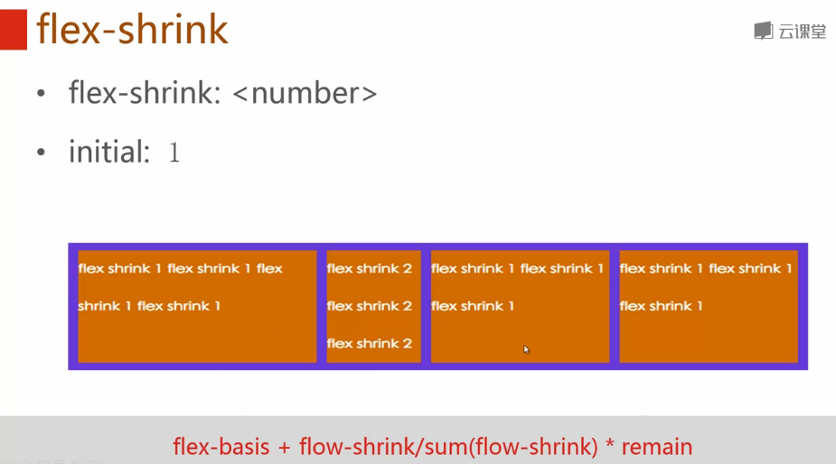
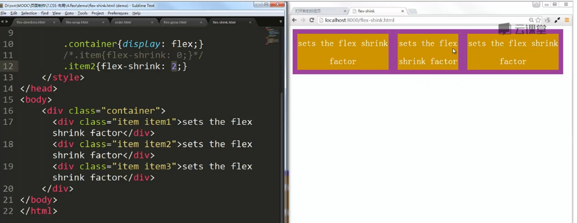

####flex
>**复合属性**。设置或检索伸缩盒对象的子元素如何分配空间。
>none：none关键字的计算值为: 0 0 auto
[ flex-grow ]：定义弹性盒子元素的扩展比率。
[ flex-shrink ]：定义弹性盒子元素的收缩比率。
[ flex-basis ]：定义弹性盒子元素的默认基准值。


####justify-content (适用于父类容器上)
>设置或检索弹性盒子元素在主轴（横轴）方向上的对齐方式。
>当弹性盒里一行上的所有子元素都不能伸缩或已经达到其最大值时，这一属性可协助对多余的空间进行分配。当元素溢出某行时，这一属性同样会在对齐上进行控制。
>
>flex-start：弹性盒子元素将向行起始位置对齐。
>flex-end：弹性盒子元素将向行结束位置对齐。
>center：弹性盒子元素将向行中间位置对齐。
>space-between：弹性盒子元素会平均地分布在行里。
>space-around：弹性盒子元素会平均地分布在行里，两端保留子元素与子元素之间间距大小的一半。


####align-items (适用于父类容器上)
>设置或检索弹性盒子元素在侧轴（纵轴）方向上的对齐方式。
>
>align-items: flex-start | flex-end | center | baseline | stretch
>**flex-start**：弹性盒子元素的侧轴（纵轴）起始位置的边界紧靠住该行的侧轴起始边界。
**flex-end**：弹性盒子元素的侧轴（纵轴）起始位置的边界紧靠住该行的侧轴结束边界。
**center**：弹性盒子元素在该行的侧轴（纵轴）上居中放置。（如果该行的尺寸小于弹性盒子元素的尺寸，则会向两个方向溢出相同的长度）。
**baseline**：如弹性盒子元素的行内轴与侧轴为同一条，则该值与'flex-start'等效。其它情况下，该值将参与基线对齐。
**stretch**：如果指定侧轴大小的属性值为'auto'，则其值会使项目的边距盒的尺寸尽可能接近所在行的尺寸，但同时会遵照'min/max-width/height'属性的限制。

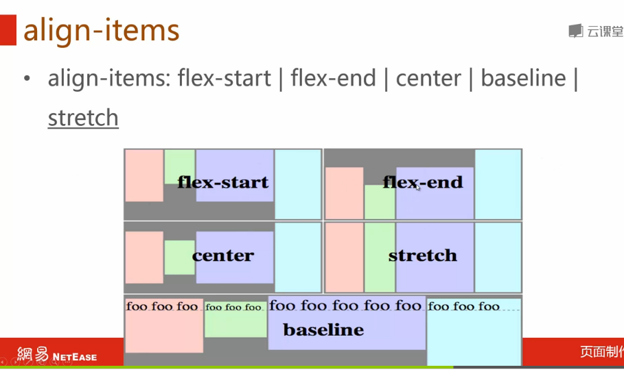

> 像vertical-align；


####align-self (适用于弹性盒模型子元素)
>设置或检索弹性盒子元素自身在侧轴（纵轴）方向上的对齐方式。属性类似align-items
>
>**align-self**: auto | flex-start | flex-end | center | baseline | stretch


####align-content
>设置或检索弹性盒在**副轴**上的对齐方式。
>
>**flex-start：**各行向弹性盒容器的起始位置堆叠。
>**flex-end：**各行向弹性盒容器的结束位置堆叠。
>**center：**各行向弹性盒容器的中间位置堆叠。
>**space-between：**各行在弹性盒容器中平均分布。
>**space-around：**各行在弹性盒容器中平均分布，两端保留子元素与子元素之间间距大小的一半。
>**stretch：**各行将会伸展以占用剩余的空间。


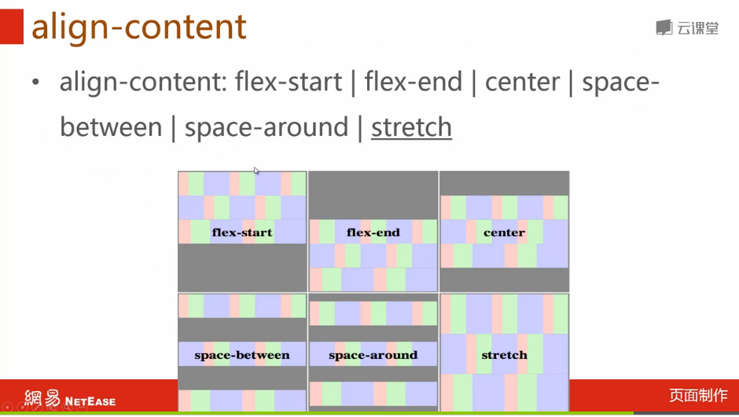
####三行两列自适应布局

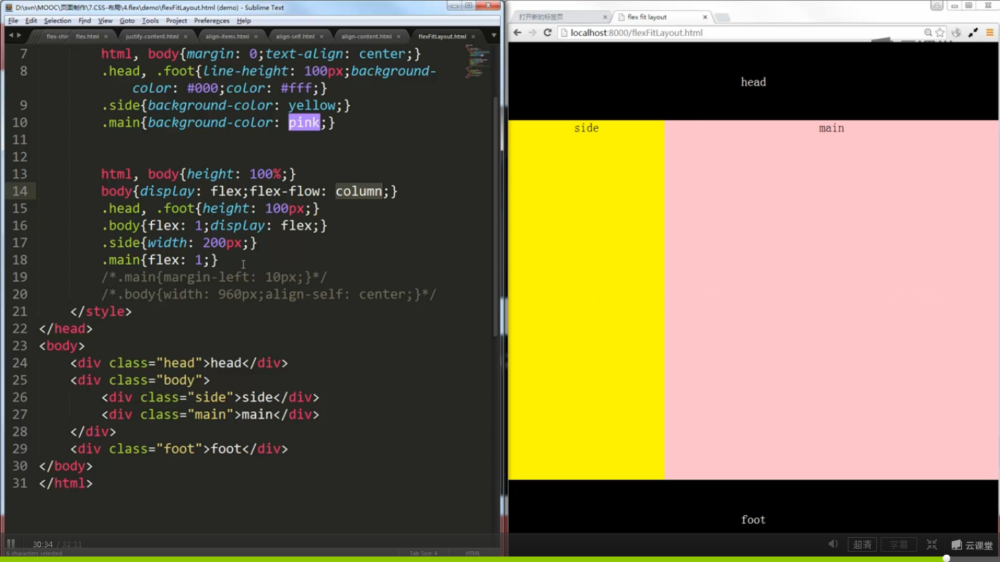
>flex ie9及以下不支持，目前主要用于移动web页面中.
>
>资料可参考：http://caibaojian.com/flexbox-guide.html#t11


