******目录**：

>笔记持续更新，原地址: https://github.com/Niefee/Wangyi-Note ;


<ul>
<li><ul>
<li><a href="#选择器">选择器</a></li>
<li><a href="#简单选择器">简单选择器</a><ul>
<li><a href="#标签选择器">标签选择器</a></li>
<li><a href="#类选择器">类选择器</a></li>
<li><a href="#id选择器">id选择器</a></li>
<li><a href="#通配符选择器">通配符选择器</a></li>
<li><a href="#属性选择器">属性选择器</a></li>
<li><a href="#伪类选择器">伪类 选择器</a></li>
<li><a href="#伪元素选择器">伪元素选择器</a></li>
<li><a href="#组合选择器">组合选择器</a></li>
</ul>
</li>
<li><a href="#继承">继承</a></li>
<li><a href="#css优先级">css优先级</a><ul>
<li><a href="#css层叠">css层叠</a></li>
<li><a href="#css优先级-改变">css优先级 改变</a></li>
</ul>
</li>
</ul>
</li>
</ul>

##选择器
----------

1. 简单选择器 
2. 伪元素选择器
3. 组合选择器

##简单选择器
###标签选择器

###类选择器
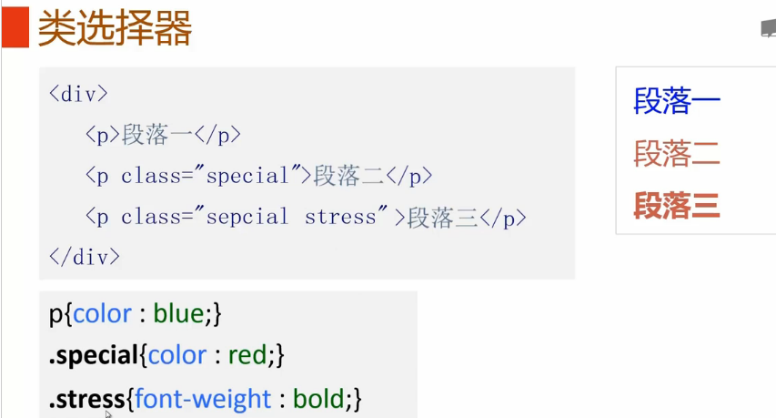
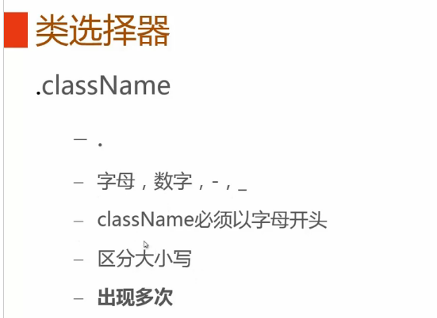
###id选择器
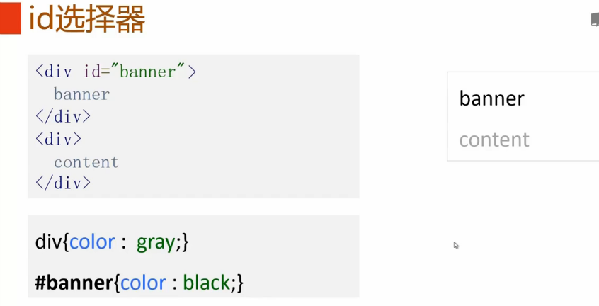
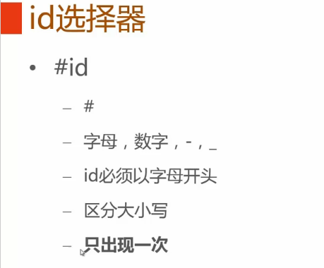
###通配符选择器
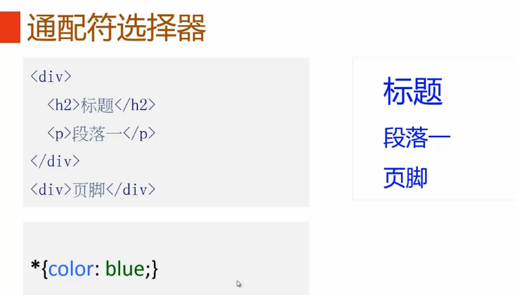
###属性选择器


1. **E[attr]**：只使用属性名，但没有确定任何属性值；
 E[attr="value"]：指定属性名，并指定了该属性的属性值；
 ```
 .demo a[id] {background: blue; color:yellow;font-weight:bold;}
 ```
 
 >如E[attr1][attr2], 这样只要是同时具有这两属性的元素都将被选中：

2. **E[attr~="value"]**：指定属性名，并且具有属性值，此属性值是一个词列表，并且以空格隔开，其中词列表中包含了一个value词，而且等号前面的“〜”不能不写；
```
.demo a[title~="website"]{background:orange;color:green;}
```


 3.**E[attr^="value"]**：指定了属性名，并且有属性值，属性值是以value开头的；
```
.demo a[href^="http://"]{background:orange;color:green;}
			.demo a[href^="mailto:"]{background:green;color:orange;}
```


4.**E[attr$="value"]**：指定了属性名，并且有属性值，而且属性值是以value结束的；

```
.demo a[href$="png"]{background:orange;color:green;}
```

5.**E[attr*="value"]**：指定了属性名，并且有属性值，而且属值中包含了value；
```
.demo a[title*="site"]{background:black;color:white;}
```


6.**E[attr|="value"]**：指定了属性名，并且属性值是value或者以“value-”开头的值（比如说zh-cn）;
```
.demo a[lang|="zh"]{background:gray;color:yellow;}
```


7.**E[attr="value"]**：指定属性名，并指定了该属性的属性值；
```
.demo a[id="first"] {background: blue; color:yellow;font-weight:bold;}
```


###伪类选择器
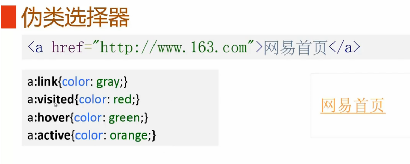
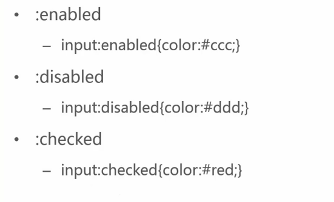
>具体语法请参考：http://www.w3cplus.com/css3/pseudo-class-selector

###伪元素选择器
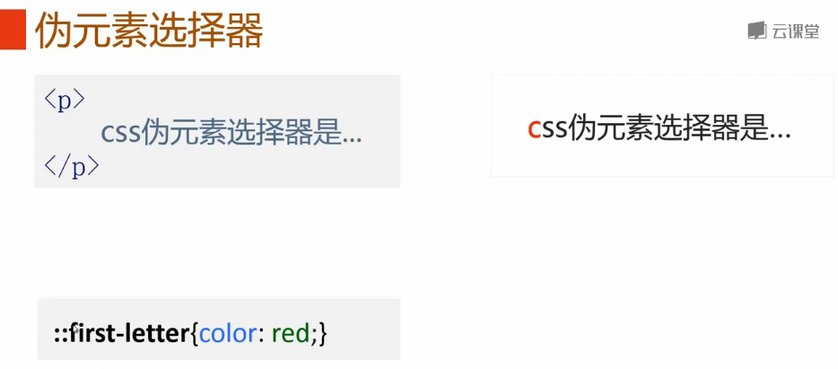

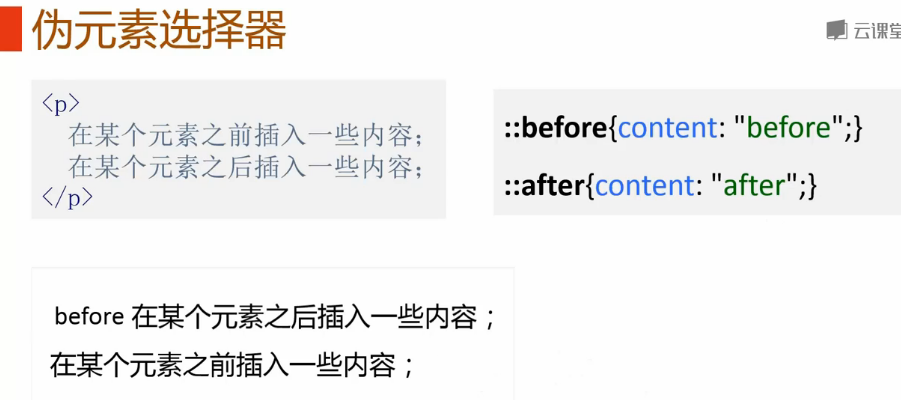
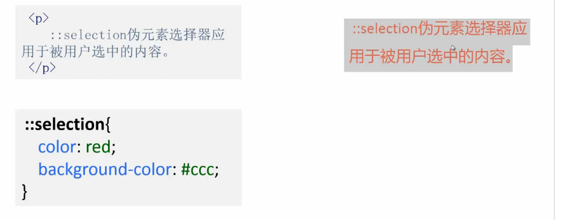
###组合选择器
一、后代选择器（Ｅ Ｆ）
后代选择器也被称作包含选择器,所起作用就是可以选择某元素的所有后代元素。
```
.demo li {color: blue;}
```
上面表示的是，选中div.demo中所有的li元素


二、子元素选择器(E>F)
子元素选择器只能选择某元素的子元素，其中E为父元素，而F为子元素，其中E>F所表示的是选择了Ｅ元素下的所有子元素Ｆ。
```
ul > li {background: green;color: yellow;}
```
上在代码表示选择ul下的所有子元素li。如：


三、相邻兄弟元素选择器(E + F)
**搞定E后面的F元素就行了。**
相邻兄弟选择器可以选择紧接在另一元素后的**所有元素**，而且他们具有一个相同的父元素。
```
li + li {background: green;color: yellow; border: 1px solid #ccc;}
```
上面代码表示选择li的相邻元素li，我们这里一共有十个li，那么上面的代码选择了从第2个li到 10 个li，一共九个，请看效果：


因为上面的li+li其中第二li是第一li的相邻元素，第三个又是第二个相邻元素，因此第三个也被选择，依此类推，所以后面九个li都被选中了，如果我们换过一种方式来看，可能会更好的理解一点：
```
.active + li {background: green;color: yellow; border: 1px solid #ccc;}
```
li.active后面相邻的li元素,仅只有一个的。如图：


四、通用兄弟选择器（Ｅ 〜 Ｆ）
**通杀E后面的F元素。**
E和F元素是属于**同一父元素**之内，并且F元素在Ｅ元素之后，那么E ~ F 选择器将选择中**所有**Ｅ元素后面的Ｆ元素。比如下面的代码：
```
.active ~ li {background: green;color: yellow; border: 1px solid #ccc;}
```
选择中了li.active 元素后面的所有兄弟元素li,如图所示：


>通用兄弟选择器和相邻兄弟选择器极其相似，只不过，相邻兄弟选择器(E + F)仅选择是元素的仅与其相邻的后面元素（选中的**仅一个**元素）；而通用兄弟元素选择器（Ｅ 〜 Ｆ），选中的是元素相邻的后面兄弟元素（可以使**多个**元素）。

>请参考：http://www.w3cplus.com/css3/basic-selectors

##继承
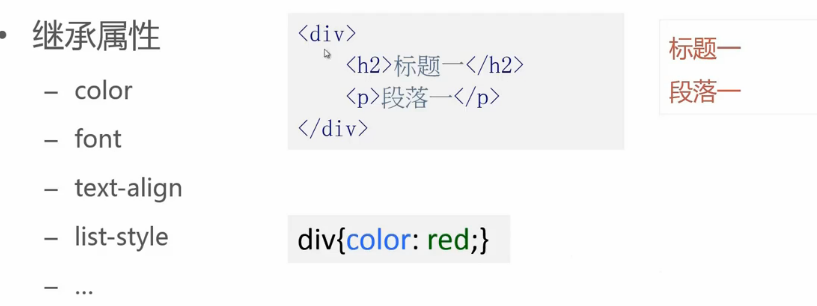
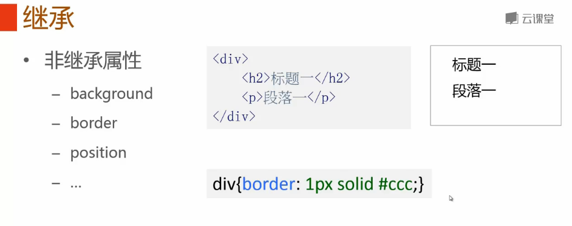
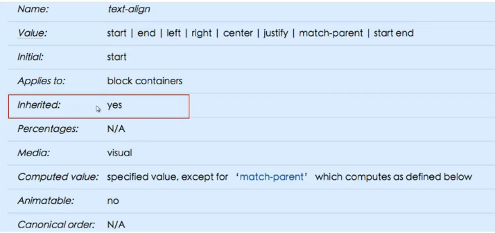
##css优先级
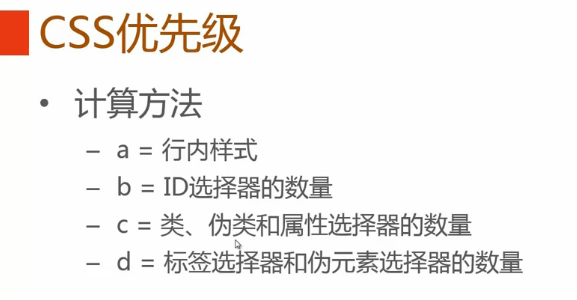

###css层叠
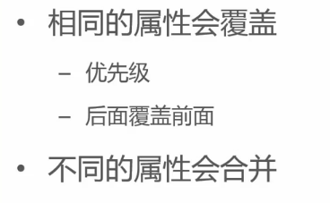

###css优先级 改变

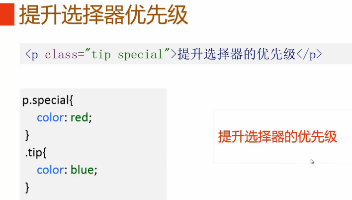
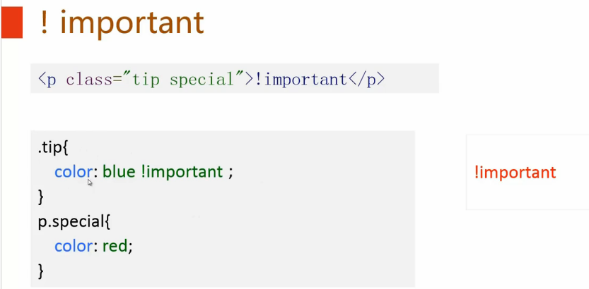


